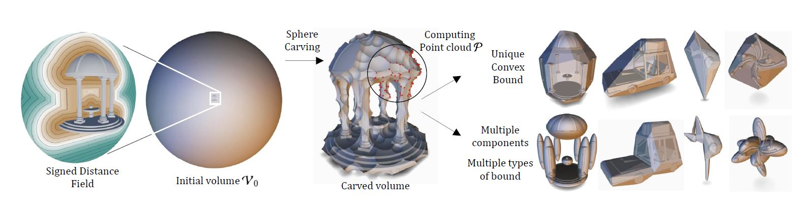

# Sphere Carving

This is the code release repository for the 2025 SIGGRAPH paper *Sphere Carving: Bounding Volumes for Signed Distance Fields*. 
Note that this implementation differs from the one presented in the paper.



[Project page](https://aparis69.github.io/SphereCarving/index.html)

[Video](https://aparis69.github.io/SphereCarving/documents/video.mp4)

## Compile

Clone the repository using:
```
git clone https://github.com/H-Schott/SphereCarvingRelease.git
```

Can be compiled on Windows or Linux using the CMake file. 
This demo requires OpenGl 4.3, but will work with minimal adaptation with lower versions.

On Linux, additional packages may be required:
```
libxi-dev libxcursor-dev libxinerama-dev libxrandr-dev
```

## Workflow

The app will start with a default shape and its associated bound computed with sphere carving. 
Clicking *iterate* will perform a new iteration of sphere carving, leading to a tighter bound.
New example shapes may be added in the future.

## License and Citation
```
@article{schott2025,
	title = {Sphere Carving: Bounding Volumes For Signed Distance Fields},
	author = {Schott, Hugo and Thonat, Theo and Lambert, Thibaud and Guérin, Eric and Galin, Eric and Paris, Axel},
	journal = {ACM Transaction on Graphics (SIGGRAPH '25 Conference Proceedings)},
	publisher = {ACM},
	year = {2025},
	number = {},
	volume = {}
}
```
This code is released under MIT License.
